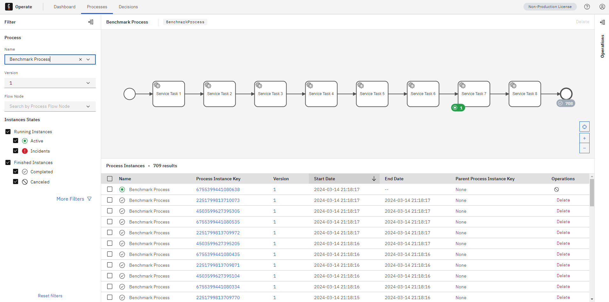
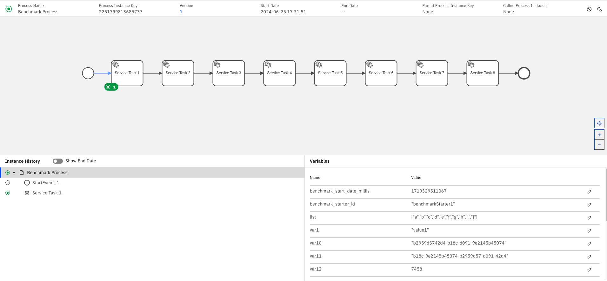
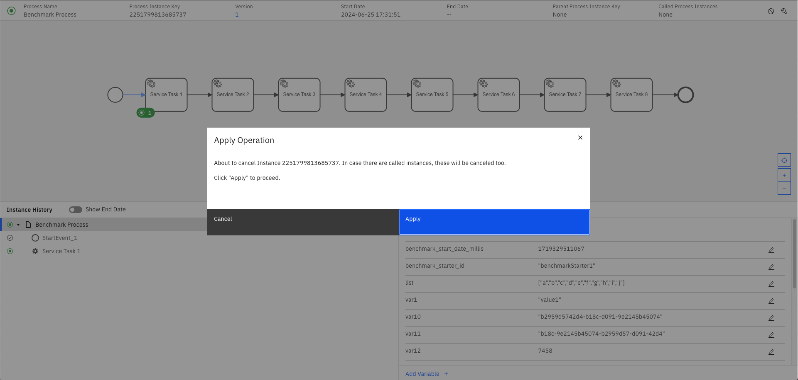
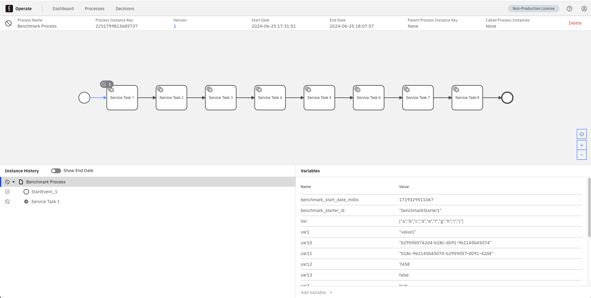

# Trigger Backup and Restore

## Apply shared script config

We will use a shared script config.

```bash
kubectl apply -f ./script-config.yaml
```

## Create Demo Environment

### Create Minio

```bash
helm upgrade --install minio oci://registry-1.docker.io/bitnamicharts/minio -f ./minio-values.yaml 
```

### Install Camunda

```bash
helm upgrade --install camunda camunda/camunda-platform -f ./camunda-values.yaml --version 11.7.0
```

### Register Snapshot Repositories

```bash
kubectl apply -f ./es-snapshot-minio-job.yaml
```
```bash
kubectl delete -f ./es-snapshot-minio-job.yaml
```

### Generate Data

```bash
kubectl create configmap models --from-file=CamundaProcess.bpmn=./backup/BenchmarkProcess.bpmn
kubectl label configmap models type=camunda-backup-restore
```

```bash
kubectl apply -f ./backup/zbctl-deploy-job.yaml 
```

```bash
kubectl create configmap payload --from-file=./backup/payload.json
kubectl label configmap payload type=camunda-backup-restore
```

```bash
kubectl apply -f ./backup/benchmark.yaml && sleep 60 && kubectl delete -f ./backup/benchmark.yaml
```

### Review Current State



## Perform Backup

```bash
kubectl apply -f ./backup/create-backup.yaml
```
```bash
kubectl delete -f ./backup/create-backup.yaml
```

## Simulate Data Loss

### Simulate Disaster for Both Zeebe and Elasticsearch
**Using Kubernetes Job (requires RBAC)**

```bash
kubectl apply -f ./simulate-disaster.yaml
kubectl apply -f ./simulate-es-disaster.yaml
```

Wait for jobs to complete, then cleanup:
```bash
kubectl delete -f ./simulate-disaster.yaml
kubectl delete -f ./simulate-es-disaster.yaml
```

At this point:
- All Zeebe brokers have lost their data (empty data directories)
- All Camunda indices in Elasticsearch have been deleted
- Zeebe pods are still running but cannot function without data

## Restore

### Stop Camunda Components for Restore

Scale down Zeebe and webapps to prepare for restore:

```bash
helm upgrade camunda camunda/camunda-platform --version 11.7.0 -f ./camunda-values.yaml -f ./restore/camunda-index-restore.yaml
```


Set the backup id you want to restore from to the `scamunda-script-config` and apply it again:
```bash
kubectl apply -f ./script-config.yaml
```


### Restore Snapshots

```bash
kubectl apply -f ./restore/es-snapshot-restore-job.yaml
```

```bash
kubectl delete -f ./restore/es-snapshot-restore-job.yaml
```

### Restore Zeebe

Now we'll restore Zeebe from the backup. Since we deleted the data directory, Zeebe will restore from the S3 backup when started with restore mode:

```bash
helm upgrade camunda camunda/camunda-platform --version 11.7.0 -f ./camunda-values.yaml -f ./restore/camunda-zeebe-restore.yaml
```

delete statefulset (so that regular statefulset can be created next)
```bash
kubectl delete statefulsets.apps camunda-zeebe
```

### Return to normal platform state
```bash
helm upgrade --version 11.7.0 camunda camunda/camunda-platform -f ./camunda-values.yaml
```

## Validate Restore

### Operate


### Zeebe

#### Find an active Instance



#### Cancel it via Operate UI



#### Validate Cancellation



## Cleanup

```bash
helm uninstall camunda
```

```bash
helm uninstall minio
```

```bash
kubectl delete all -l type=camunda-backup-restore
```

```bash
kubectl delete pvc -l app.kubernetes.io/instance=camunda
```
